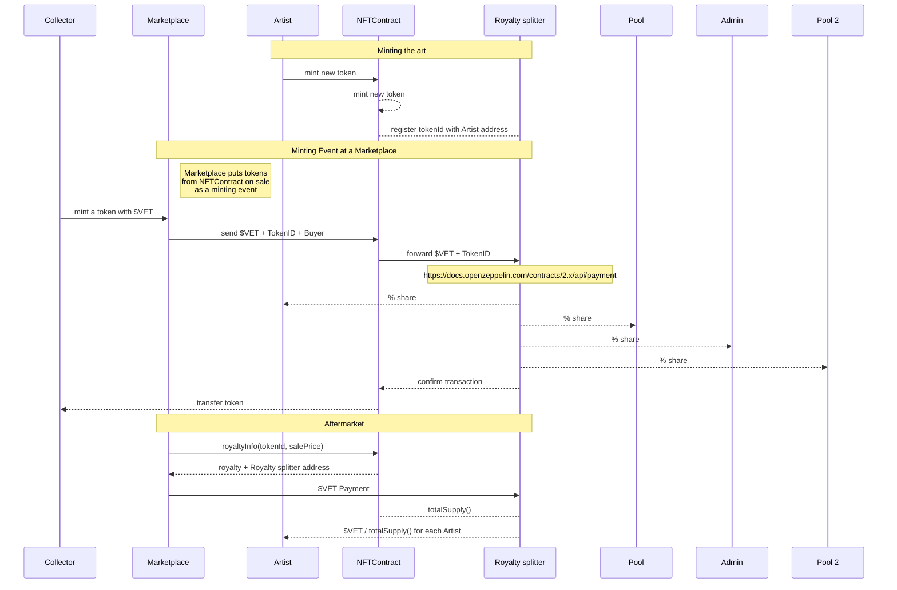

## Goal

Goal of the project is a multi artist collaboration project that shares the revenus of token sales:

1. 70% for Artists
1. 20% into a Pool
1. 8% locked in Contract until Collectors claim
1. 2% stay in Contract, claimable by the owner

## Reponsibilities

1. Another contract mints the Art
1. Royalty on mint and payments are handled somewhere else (Marketplace)
1. **This** Contract receives the royalty from mint and splits the revenue

## Participant

1. Marketplace
   * a public existing Marketplace
1. Artists
   * creator of the art
1. Admin
   * claim fees in contract
   * configure Pool address
1. Pool
   * wallet address
   * receiving part of the revenue
1. NFTContract
   * a standard NFT Contract
   * with extension to instruct the Royalty splitter
1. Royalty splitter
   * contract
   * an implementation of a payment splitter

