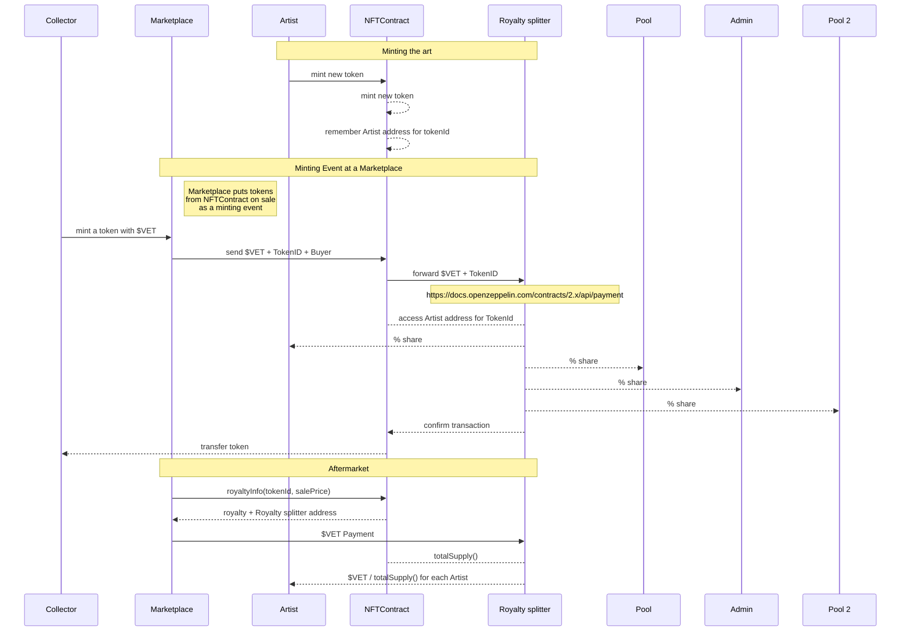

## Goal

Goal of the project is a multi artist collaboration project that shares the revenues of token sales:

1. 70% for Artists
1. 20% into a Pool, claimable by Artists
1. 8% into a Pool, claimable by Token Owner
1. 2% for Admin

## Reponsibilities

1. Another contract mints the Art
1. Royalty on mint and payments are handled somewhere else (Marketplace)
1. **This** Contract receives the royalty from mint and splits the revenue
1. Another contract is responsible for the Pool-Management

## Participant

1. Marketplace
   * a public existing Marketplace
   * provide access to the Collectors/audience
1. Artists
   * creator of the art
1. Admin
   * claim fees in contract
   * configure Pool address
1. Pool
   * wallet or contract address
   * receiving part of the revenue
1. NFTContract
   * a standard NFT Contract
   * with extension to remember initial minter
   * all token related data is stored within this contract   
1. Royalty splitter
   * contract
   * an implementation of a payment splitter
   * accesses NFTContract to read token related information (minter, owner)

## Process

## Links

1. Discord-Discussion: https://discord.com/channels/948215669672001596/948215669672001599/1012598084552892477
1. Payment-Splitter at OpenZeppelin: https://docs.openzeppelin.com/contracts/4.x/api/finance
1. NFT Template at OpenZeppelin: https://docs.openzeppelin.com/contracts/4.x/erc721
1. NFT Royalty Standard at OpenZeppelin: https://docs.openzeppelin.com/contracts/4.x/api/interfaces#IERC2981
