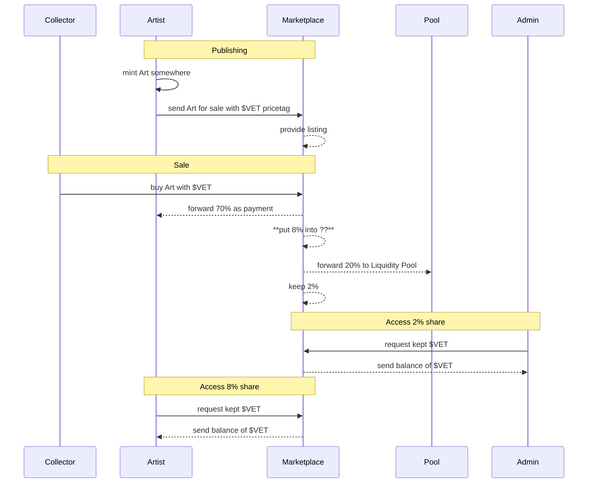

## Goal

Goal of the project is a multi artist collaboration project that shares the revenus of token sales:

1. 70% for Artists
1. 20% into a Pool
1. 8% locked in Contract until Collectors claim
1. 2% stay in Contract, claimable by the owner

## Participant

1. Collector
   * purchasing the Art by sending VET
1. Artists
   * mint Art on a different platform
   * send Art as NFT with a price tag
1. Admin
   * claim fees in contract
   * configure Pool address
1. Pool
   * wallet address
   * receiving part of the revenue
1. Marketplace
   * Contract
   * responsible for sharing revenue
   * owns the art on sale

